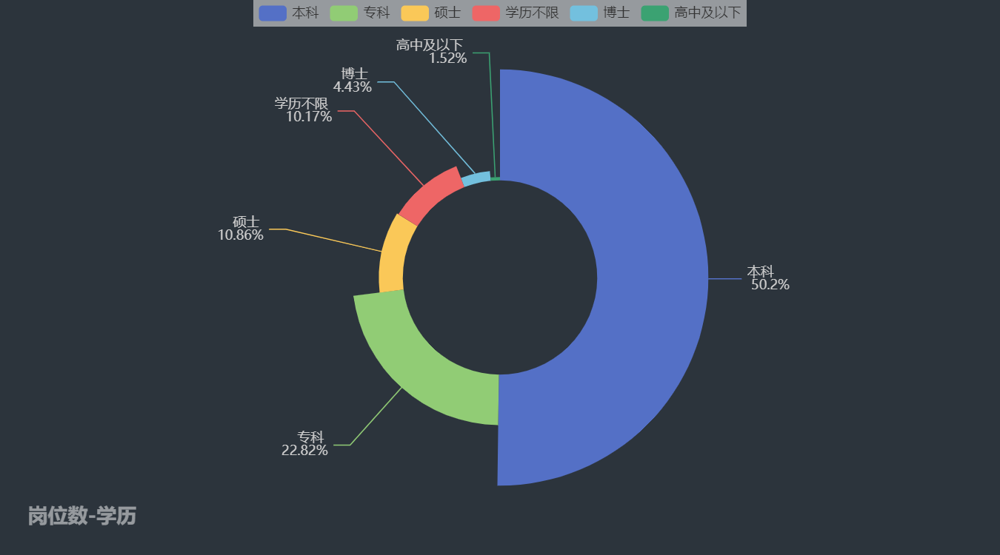
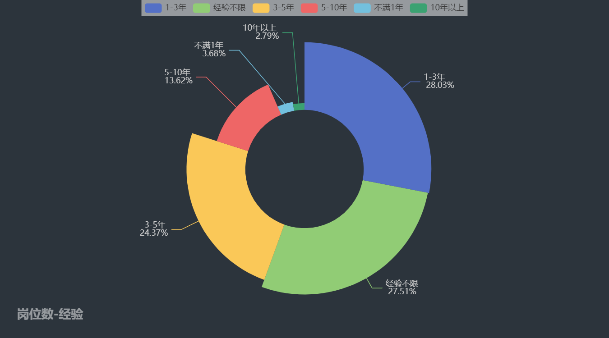
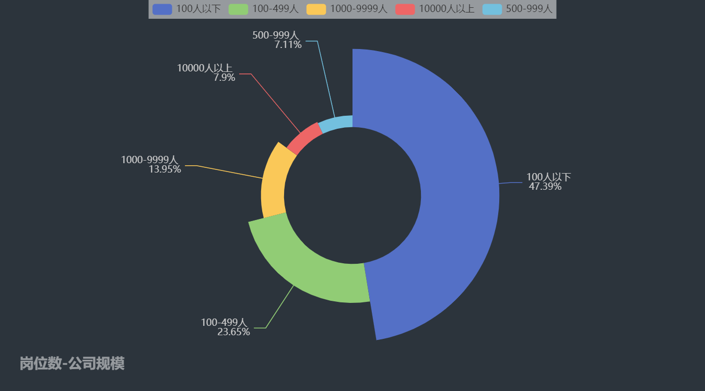
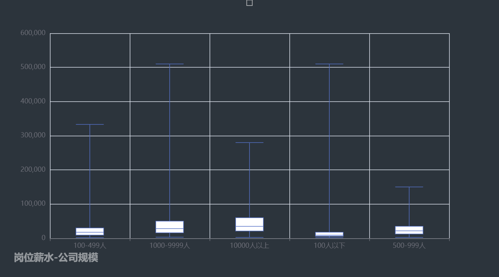
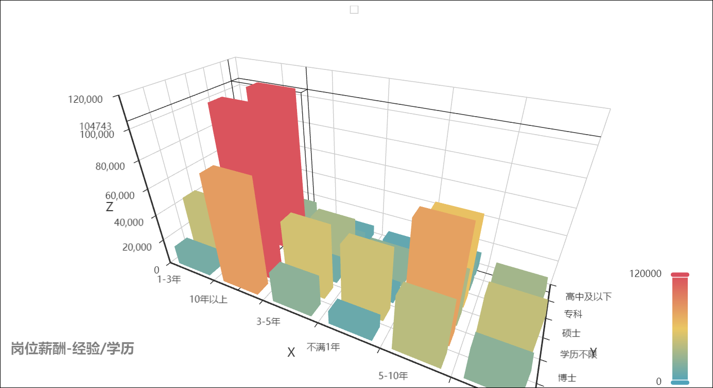
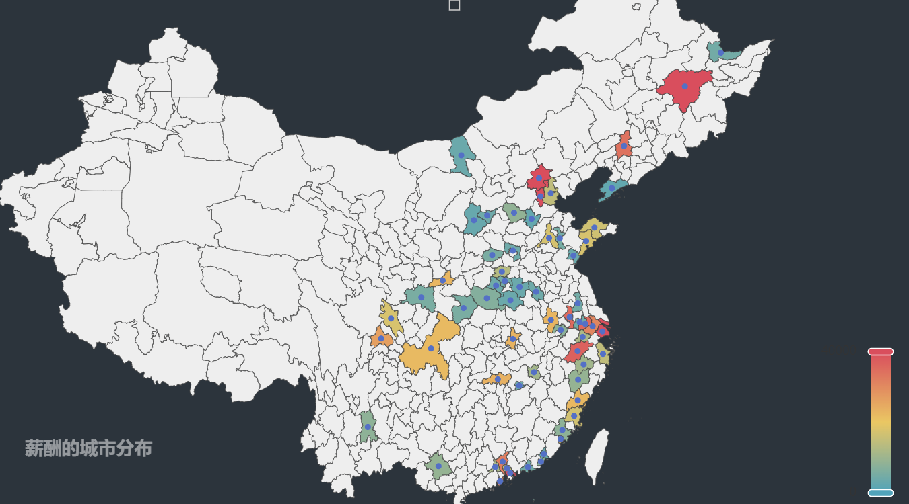

# AIjob-Spider
## 项目描述

项目：全国热门城市人工智能AI岗位数据爬取、数据分析与可视化

介绍：通过爬取招聘网站（boss直聘 https://www.zhipin.com ） 热门城市AI岗位信息，对数据进行清洗，分析并可视化全国热门城市人工智能AI岗位的学历要求、工作经验、公司规模、技能要求、薪资之间的关系。

## 项目配置

1、安装第三方库对应版本

```python
requests	(2.31.0)
numpy   	(1.26.0)
pandas 		(2.1.0)
re			(2.2.1)
jupyter 	(1.0.0)
IPython		(8.17.2)
selenium 	(4.15.0)
jsonpath	(0.82.2)
lxml		(4.9.3)
pyechart 	(2.0.4)
```

2、运行爬虫（已有数据，不必再次爬取）

```python
1、打开project
2、运行spider文件夹下的spider_semi.py 或 spider_auto.py
3、爬取的数据保存在spider/data文件夹下

说明：由于全自动auto爬虫ip限制，故使用半自动爬虫semi并将结果已经放于analysis的data文件夹下，无需进行爬取
```

3、运行数据分析与可视化

```java
1、进入到analysis文件夹
2、打开jupyter notebook
3、运行analysis.ipynb
4、可视化html输出在html文件夹中，notebook同时内嵌显示
```


项目结构

```pthon
│  README.md
│
├─picture  								# README.md图片文件夹
│
├─analysis		# 数据分析
│  │  analysis.ipynb					
│  │
│  ├─.ipynb_checkpoints
│  │      analysis-checkpoint.ipynb
│  │
│  ├─data								# 已爬取好的csv数据文件夹
│  │  │  data.csv 						
│  │  │
│  │  └─.ipynb_checkpoints
│  │          data-checkpoint.csv
│  │
│  └─html 								# 生成的可视化html文件夹
│
└─spider 		# 爬虫
    │  chromedriver.exe
    │  spider_auto.py
    │  spider_semi.py
    │
    └─data								# 爬虫爬取结果文件夹
```


## 结果图片

- 爬取过程

  

- 饼图
    <table border="0" cellspacing="0" cellpadding="0">
        <tr>
            <td></td>
            <td></td>
            <td></td>
        </tr>
    </table>
```python

1、经验要求不限、在1-3年、3-5年的比重可谓三权分立。  
相比于卷了几十年的软件工程等计算机专业其他分流，AI起步较晚，对经验要求较低。 
2、本科可以从事AI工作的岗位数量占比超过了50%，说明本科毕业仍然能找到一份AI相关的工作。
3、公司规模在100人以下的占比接近50%，说明AI相关岗位有很多初创公司、小型公司。
```
- 箱线图
  


- 词云图

  
```python
1、深度学习框架TensorFlow、PyTorch占比较大，并且机器学习算法/工程化经验、统计等数学知识的要求明显较高。 
2、在非互联网岗位如PS、机器人、销售等行业中AI也在逐渐渗透，表明AI在传统行业仍然有很好的前景。
```

- 3d柱状图

  
```python
1、可以看到，硕士博士的起步工资要高于本科专科，在5年以下博士的平均工资远远高于相同经验的其他学历的工资。
2、具有5-10、10年以上经验的硕士、博士的工资水平遥遥领先。  
3、本科的工资随着经验的增加也有着不错的提升，而专科的薪酬提升就比较困难了。
```
- 地图

  
```python
1、北京、上海一线城市，杭州、天津等沿海城市AI岗位薪酬比较高，在35-60万左右。  
2、武汉、重庆、西安、合肥等靠近中部地区AI岗位薪酬较为中等，在20-30万左右。  
3、太原、晋城等靠近中部偏北部的城市薪酬偏低，甚至许多薪酬没有过万，可能大多数岗位是需要AI的非互联网行业。
```
## 


